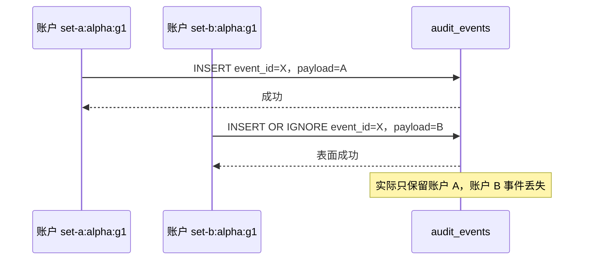

# P4 独立审计证据包（2026-07-12）

> 本文件面向实施／审计 Agent，保存稳定版本上的技术证据。人类进度入口仍是 `ROADMAP.md`。

## 审计范围与结论

- 审计 commit：`32781ebdf09b2836cabb2a594b0fe5c8b76e7967`
- 父 commit：`4a012361043a9f06383240a735bea908262ff4c8`
- 分支：`codex/p4-dashboard`
- 审计开始时工作树：clean
- 结论：红。P4 本地实现和测试制品已经存在，但在下列 P0／P1 问题关闭前，不得标记 P4 完成、不得部署、不得运行发布 workflow。
- 本次动作：只读检查、临时目录最小复现和离线测试；未修改 P4 业务代码、CI／部署配置、数据库或外部系统。

## 已实际验证

正确设置 `PYTHONPATH=src` 和 `PYTHONDONTWRITEBYTECODE=1` 后，运行：

```powershell
python -m unittest discover -s tests -v
```

结果为 41 项全部通过。第一次未设置 `PYTHONPATH` 的运行在测试收集阶段出现 3 个 `ModuleNotFoundError`，属于命令环境错误，不计为代码回归失败。

现有测试还证明服务器会按 `received_at` 在 90 秒后生成 `RUNNER_OFFLINE` 告警。该项通过，但不能抵消下列未覆盖问题。

## 最小复现结果

审计使用操作系统临时目录运行单次复现，没有写入仓库或正式数据：

```json
{
  "bundle_same_id": true,
  "bundle_same_hash": true,
  "bundle_same_bytes": false,
  "live_status_outbox_rows_after_two_versions": 1,
  "live_status_surviving_payload": "status-2.json",
  "events_after_same_id_different_account": 1,
  "surviving_event_account": "set-a:alpha:g1",
  "asset_without_identity_status": 200,
  "spa_without_identity_status": 403
}
```

这证明当前 41 项测试存在关键盲区，不能作为 P4 完整验收证据。

## 失败时序图

```mermaid
sequenceDiagram
    participant R as Windows runner
    participant B as Bundle／Status builder
    participant O as Observability DB／Outbox
    participant S as Dashboard server
    participant U as 未认证浏览器

    R->>B: 用事实 F 和时间 T1 生成 Bundle
    B->>O: 写入 ID X、哈希 H、字节 A
    R->>B: 用同一事实 F 和时间 T2 重建
    B->>O: 仍写入 ID X、哈希 H、字节 B
    Note over O: generated_at 不参与哈希，第二份被当作幂等重复

    R->>O: 心跳 1，以 source_id 入队
    R->>O: 心跳 2，以同一 source_id 入队
    Note over O: ON CONFLICT 覆盖心跳 1 的 payload

    U->>S: GET /assets/app.js，无身份头
    S-->>U: 200 StaticFiles
    U->>S: GET /，无身份头
    S-->>U: 403 路由依赖
```





## P0-1：存在未经批准的外部发布路径和部署端口漂移

- 位置：`.github/workflows/publish-dashboard.yml:8` 授予 `packages: write`，`.github/workflows/publish-dashboard.yml:50` 设置 `push: true`；`deploy/compose.yaml:8` 映射 `127.0.0.1:8080:8080`。
- 时序：人工触发 workflow → 使用 `GITHUB_TOKEN` 登录 GHCR → 构建并推送镜像。该行为不是“仅检查”；Compose 的主机监听端口也不是已批准的 `127.0.0.1:18080`。
- 当前结果：文件已进入本地 commit；本次审计没有运行 workflow、push 或部署。
- 修复前失败测试：增加 CI 静态策略检查，发现 `packages: write`、registry login、`push: true`、部署步骤或非批准主机端口时失败。
- 修复后回归标准：仓库仅保留 Python 测试、前端检查／构建和 `push: false` 的 Docker build；Compose 只映射 `127.0.0.1:18080`；无发布、部署和生产密钥读取能力。
- 修复状态：待 Yancey 单独确认后实施。修改／删除 workflow 和部署配置属于 CI/CD 红线，本次不处理。
- 残余风险：即使改为手动触发，只要发布 workflow 存在，误操作和越权发布路径仍存在。

## P0-2：静态资源绕过浏览器身份校验

- 位置：`src/astock/dashboard/app.py:133` 直接挂载 `/assets`；身份依赖只应用在 FastAPI 路由上。
- 时序：未认证浏览器请求 `/assets/app.js` → Starlette `StaticFiles` 直接处理 → 不经过 `require_browser_user` → 返回 `200`。同一客户端请求 SPA `/` 返回 `403`。
- 修复前失败测试：在临时静态目录创建资源，断言无身份头访问 SPA、`/assets/*` 和所有浏览器 API 均为 `403`，允许用户均为 `200`。
- 修复后回归标准：除 `/healthz` 和 Bearer token 上传接口外，统一中间件保护 SPA、静态资源和浏览器 API。
- 结果差异：当前 `/assets/app.js=200`、`/=403`；修复后两者在无身份时都应为 `403`。
- 修复状态：待实施；回归结果待实施后补充。
- 残余风险：静态 JS／source map 即使不含账户数据，也会暴露页面结构和接口约定；后续新增挂载点可能再次绕过路由依赖。

## P1-1：同一 Bundle ID 可对应不同字节

- 位置：`src/astock/observability/bundle.py:83` 把 `generated_at` 放入 Bundle；`src/astock/observability/bundle.py:94` 又在完整性哈希中排除它；`tests/test_observability.py:64-65` 明确接受修改生成时间后复用同一文件。
- 时序：同一事实用不同墙钟时间重复生成 → `bundle_id` 和 `content_sha256` 相同 → JSON 字节不同 → 本地和服务器把第二份当作幂等重复而静默接受。
- 修复前失败测试：同一持久化 run 生成两次必须字节相同；改变 `generated_at` 后旧哈希必须校验失败；同一 ID 不同字节必须返回冲突。
- 修复后回归标准：生成时间来自已持久化任务完成事实并参与内容哈希；同一输入得到相同规范 JSON、哈希和 ID。
- 结果差异：当前“同 ID、同哈希、不同字节”；修复后只允许“同 ID、同哈希、同字节”。
- 修复状态：待实施；回归结果待实施后补充。
- 残余风险：还需冻结时区、十进制和列表排序规则，避免跨平台序列化漂移。

## P1-2：新心跳覆盖未发送的旧心跳

- 位置：`src/astock/observability/repository.py:105` 对 `(object_type, object_id)` 唯一；`src/astock/observability/repository.py:307` 冲突时覆盖 payload；`src/astock/observability/runner.py:191` 始终以 `source_id` 入队；上传路径也以 `source_id` 为对象 ID。
- 时序：断网 → 心跳 1 入队 → 30 秒后心跳 2 用同一 Outbox ID 入队 → 心跳 1 的 payload 路径被覆盖 → 恢复网络后只能发送心跳 2。
- 修复前失败测试：断网期间连续生成两版 `LiveStatus`，断言存在两个不可变 payload 和两个独立 Outbox 项；恢复后按序幂等上传两版。
- 修复后回归标准：`LiveStatus` 拥有独立 `status_id`，Outbox 以该 ID 唯一；服务器按 `source_id` 维护最新视图，同时保留各版接收回执。
- 结果差异：当前两版后只剩 1 行且指向 `status-2.json`；修复后应保留 2 行和 2 个 payload。
- 修复状态：待实施；回归结果待实施后补充。
- 残余风险：需要明确积压上限和保留策略，但不得在未确认前自动删除审计证据。

## P1-3：跨账户事件 ID 冲突被静默吞掉

- 位置：`src/astock/observability/repository.py:237` 使用 `INSERT OR IGNORE`；业务事件 ID 没有统一包含 `account_id`／账户代次。
- 时序：账户 A 先写入事件 ID X → 账户 B 写入相同 ID X、不同 payload → SQLite 忽略第二次写入 → 调用方仍收到 X 且不知道数据丢失。
- 修复前失败测试：两个策略集合／账户代次以相同业务局部 ID 写入不同事件，必须分别保存；同一全局 ID 不同内容必须显式报错。
- 修复后回归标准：稳定 ID 包含 `strategy_set_id`、账户、代次和业务对象；所有幂等写入先比较规范内容，相同内容返回成功，不同内容拒绝。
- 结果差异：当前两账户写入后只有账户 A 的 1 行；修复后应为两个不同全局 ID，或对错误复用明确失败。
- 修复状态：待实施；回归结果待实施后补充。
- 残余风险：策略集合、账户登记、快照和交易账本中的其他 `INSERT OR IGNORE` 也要逐项审计，不能只修事件表。

## P1-4：服务存储生命周期与并发模型未闭合

- 位置：`src/astock/dashboard/app.py:33` 在进入 lifespan 前创建 Store；`src/astock/dashboard/storage.py:21` 用一个 `check_same_thread=False` 连接服务所有请求，未见串行锁或每操作连接。
- 时序：多个同步 FastAPI 路由进入线程池 → 共享同一 SQLite connection 并发读写／备份 → 事务边界和游标交错，可能出现锁、递归使用连接或部分写入。
- 修复前失败测试：并发执行重复 Bundle 上传、状态上传、查询和 online backup，验证无异常、无重复、冲突返回稳定且重启后数据一致。
- 修复后回归标准：lifespan 内创建／释放 Store；使用每操作独立连接或明确串行写锁；文件写入与索引事务定义失败恢复顺序。
- 修复状态：待实施；回归结果待实施后补充。
- 残余风险：SQLite 与 Bundle 文件是两个存储，需要补充文件已写而 DB 事务失败、DB 已写而文件缺失的恢复测试。

## P1-5：备份不是可校验的完整恢复包

- 位置：`deploy/backup.sh:7-9` 分别生成数据库、Bundle 压缩包和 `docker compose images` 文本；没有逐文件 SHA256 manifest。`tests/test_observability.py:238-248` 只验证数据库中的 Bundle 索引，不验证 Bundle 文件可加载。
- 时序：数据库备份成功 → Bundle 压缩包缺失、损坏或与数据库版本不一致 → 仅恢复数据库仍能列出索引 → 实际查看复盘时文件不存在。
- 修复前失败测试：完整备份后删除源数据，在独立目录恢复数据库与 Bundle，校验逐文件 SHA256、`load_bundle`、最新状态、告警和 API 查询；损坏任一文件必须失败。
- 修复后回归标准：一个恢复批次绑定 SQLite backup、不可变 Bundle、镜像／版本信息和 SHA256 manifest；真实恢复演练可从空目录重建可查询服务。
- 结果差异：当前测试只能恢复索引；修复后必须恢复可读取的事实文件和查询结果。
- 修复状态：待实施；真实服务器恢复仍需部署前单独确认。
- 残余风险：尚未定义备份保留、磁盘耗尽和恢复点选择；首月不得自动删除旧备份。

## 不得据此标记完成的事项

- P4 整体、确定性 `ReviewBundle`、持久化多版本心跳、全路由身份校验、并发服务存储、完整备份恢复、仅检查 CI 和目标端口部署均不得标记完成。
- 41 项 Python 测试可以记录为“当前套件通过”，但必须同时注明上述盲区。
- 修复后回归证据、Docker build、Tailscale、Android 浏览器、Windows 计划任务、断网补传和真实恢复均为待验证。
